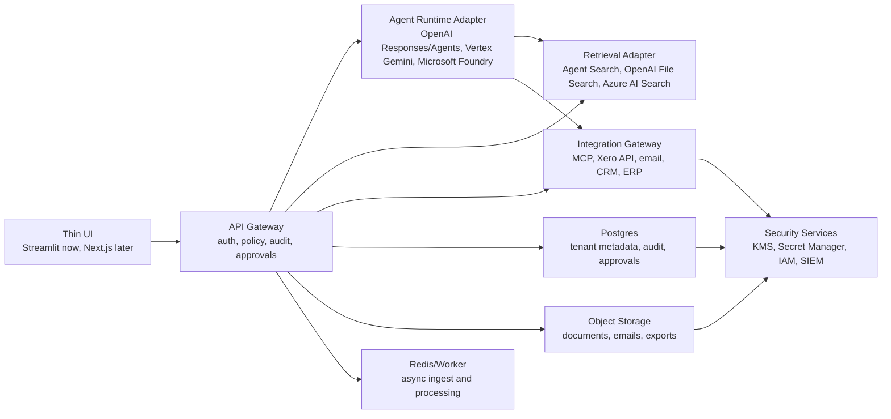

# SME Ops-Center Feasibility and Architecture Review

Date: 2026-06-14

## Executive View

The project remains feasible and commercially relevant, but the framing should move from a "GCP demo-in-a-box" to an "SME AI control plane" for South African line-of-business systems.

The original objectives are still right:

- Make AI useful inside everyday SME operations.
- Keep the UI simple enough for non-technical users.
- Ground answers in business records, with citations and refusal behavior.
- Keep finance and operational actions controlled, audited, and human-approved.
- Avoid training custom models or rebuilding ERP/CRM/accounting systems.

What has changed is the runtime and integration landscape. MCP, OpenAI Responses/Agents, Google Agent Search, Microsoft Foundry, and Microsoft Power Platform governance now make it easier to connect business systems, enforce policy, and govern AI-enabled workflows. The project should keep its trust architecture, but loosen the assumption that Vertex/Gemini must be the only runtime path.

Recommended direction:

- Keep `api-gateway` as the policy, approval, audit, and orchestration boundary.
- Keep the frontend thin and replaceable.
- Treat MCP and business-system connectors as untrusted integration boundaries, not as direct model capabilities.
- Retain provider-neutral agent/retrieval interfaces as an architecture principle, but defer implementation until a second real customer profile requires it.
- Lock the first implementation profile to `gcp-sa`: Xero plus Google/GCP, with app and document storage in South Africa where feasible and AI/search endpoints set explicitly.

## Current Feasibility

### Overall Verdict

Feasibility is high for a controlled SME PoC and medium-high for production if the next build phase adds authentication, tenant isolation, proper secrets management, connector governance, and legal/compliance documentation.

The highest-risk area is not model quality. It is the controlled movement of business data between private systems, third-party AI services, and connector/MCP servers.

### Module Feasibility

| Module | Current feasibility | Notes |
| --- | --- | --- |
| Module A - Ask Your Business | High | Managed RAG/search is mature enough. The project has upload, storage, indexing, and status plumbing. Query/citation generation is still missing. |
| Module B - Inbox Triage | High | Structured extraction, validation, and draft workflows are straightforward. The key is human approval, audit, and clear non-autonomous behavior. |
| Module C - Xero Finance Lens | Medium-high | Xero API/OAuth is viable, and the official `XeroAPI/xero-mcp-server` exists. The gateway read-only allow-list remains non-negotiable because the server exposes write-capable tools. |
| Production SME deployment | Medium-high | Feasible with hosted cloud services, but POPIA, data residency, operator contracts, access controls, and incident processes must be designed explicitly. |

## What Has Changed Since The PRD

### 1. OpenAI Runtime Options Are Now Stronger

OpenAI's current API direction favors the Responses API for new projects. The Responses API supports agent-style loops, tool calling, file search, code interpreter, remote MCP servers, multimodal input, and stateful interactions. The Agents SDK is positioned for applications that own orchestration, tool execution, approvals, and state.

Implication for this project:

- OpenAI can now be a first-class runtime option.
- A future architecture should support a runtime provider interface: `OpenAI`, `Google Vertex/Gemini`, and potentially `Microsoft Foundry/Azure OpenAI`.
- The gateway should own approvals and tool execution policy rather than delegating that fully to the model runtime.
- Do not implement OpenAI/Microsoft adapters during the `gcp-sa` execution cycle; keep them as future profiles until a second customer profile is real.

Sources:

- [OpenAI Responses API migration guide](https://developers.openai.com/api/docs/guides/migrate-to-responses)
- [OpenAI Agents SDK guide](https://developers.openai.com/api/docs/guides/agents)
- [OpenAI MCP and connectors guide](https://developers.openai.com/api/docs/guides/tools-connectors-mcp)

### 2. MCP Is Mainstream, But Must Be Governed

MCP is now a credible integration pattern for tools and data sources, and OpenAI and Microsoft both expose MCP-related platform support. However, MCP servers can expose sensitive data or actions, and tool output can carry prompt injection or data exfiltration risk.

Implication for this project:

- Keep the `mcp-bridge`, but harden it into an integration gateway.
- Do not allow the model to discover arbitrary tools in production.
- Pin connector versions and tool schemas.
- Maintain an allow-list per tenant, per module, and per role.
- Log inputs and outputs for every tool call.
- Prefer official/vendor-hosted MCP servers where available.
- For Xero, use the official `XeroAPI/xero-mcp-server` behind the gateway. Enforce read-only operations at the gateway because the MCP server includes write-capable features such as invoice creation and contact management.

Sources:

- [OpenAI MCP and connectors security notes](https://developers.openai.com/api/docs/guides/tools-connectors-mcp)
- [Microsoft Power Platform data policies and MCP connectors](https://learn.microsoft.com/en-us/power-platform/admin/wp-data-loss-prevention)
- [XeroAPI/xero-mcp-server](https://github.com/XeroAPI/xero-mcp-server)
- [Xero OAuth 2.0 documentation](https://developer.xero.com/documentation/guides/oauth2/overview/)
- [Xero Accounting API documentation](https://developer.xero.com/documentation/api/accounting/overview)

### 3. Google Vertex AI Search Has Shifted Branding And Constraints

Google documentation now refers to Vertex AI Search as Agent Search in several places. It remains a viable managed RAG/search option, including grounded answer generation and document data stores.

The important South African constraint remains: the app and many infrastructure services can be deployed in Johannesburg (`africa-south1`), but Agent Search availability is documented around `global`, `us`, and `eu` locations, not South Africa-specific AI/search processing. Google recommends `global` if there is no compliance reason to choose US/EU, but that choice must be made deliberately for POPIA and client risk posture.

Implication for this project:

- Keep the GCP path viable.
- Make endpoint and data residency choices explicit in customer onboarding.
- Store customer documents in a South African bucket where feasible.
- Treat AI/search processing location as a contractual and risk-design question.
- Do not claim "AI processing stays in South Africa" unless the selected service actually supports that.

Sources:

- [Google Agent Search locations](https://docs.cloud.google.com/generative-ai-app-builder/docs/locations)
- [Google grounded answer generation with RAG](https://docs.cloud.google.com/generative-ai-app-builder/docs/grounded-gen)
- [Google grounding with Agent Search](https://docs.cloud.google.com/gemini-enterprise-agent-platform/models/grounding/grounding-with-vertex-ai-search)
- [Google Compute Engine regions and zones](https://docs.cloud.google.com/compute/docs/regions-zones)

### 4. Microsoft Is A Serious Alternative For SA SMEs

Many SA SMEs already run on Microsoft 365, SharePoint, Outlook, Teams, Dynamics, or Power Platform. Microsoft Foundry and Power Platform now provide strong enterprise-AI and connector governance surfaces, including data policies and MCP connector control.

Implication for this project:

- For Microsoft-heavy SMEs, a Microsoft-first deployment may reduce friction.
- Power Platform/Copilot Studio can be a lower-code front door for simple workflows.
- A custom gateway is still valuable for stronger audit, policy enforcement, cross-provider choice, and non-Microsoft LoB systems.

Sources:

- [Microsoft Foundry overview](https://learn.microsoft.com/en-us/azure/foundry/what-is-foundry)
- [Microsoft Power Platform data policies](https://learn.microsoft.com/en-us/power-platform/admin/wp-data-loss-prevention)

## South African Security And POPIA View

This is not legal advice, but POPIA materially affects the architecture.

POPIA requires appropriate, reasonable technical and organisational measures to protect personal information, including preventing loss, unlawful access, or unlawful processing. It also requires reasonable steps to identify risks, maintain safeguards, verify safeguards, and update safeguards as risks change.

When an operator processes personal information for a responsible party, the responsible party must have a written contract requiring the operator to maintain the relevant security measures. Security compromises require notification to the Regulator and, generally, the affected data subject.

Cross-border transfers are restricted unless a valid basis applies, such as adequate protection through law, binding corporate rules, or binding agreement, consent, or contractual necessity.

Implication for product design:

- Maintain a processing register per tenant.
- Classify data before indexing or sending to model providers.
- Keep customer data minimised in prompts and tool calls.
- Add PII redaction or field-level masking where useful.
- Store originals and audit logs in customer-approved regions.
- Use DPAs/operator agreements with cloud/model providers.
- Make cross-border transfer basis explicit during onboarding.
- Add breach logging and incident export capability.
- Avoid solely automated decisions that have legal or substantial effects.

Sources:

- [South African Government POPIA summary page](https://www.gov.za/documents/protection-personal-information-act)
- [Protection of Personal Information Act PDF](https://www.gov.za/sites/default/files/gcis_document/201409/3706726-11act4of2013popi.pdf)

## Recommended Target Architecture

The current architecture should evolve, not be thrown away.

### Architecture Principles To Keep

- UI never calls AI providers, Xero, Postgres, Redis, or storage directly.
- API gateway owns trust enforcement and stable contracts.
- Every user request gets a request ID and audit record.
- All generated answers over business records require evidence.
- All external actions are draft-only until human approval.
- Finance starts read-only.
- Redis remains a queue/cache, never a system of record.
- Secrets move to Secret Manager/KMS for deployed environments.

### Architecture Principles To Add

- Provider-neutral interfaces for model, retrieval, and tool execution. Implementation is deferred until a second customer profile is real.
- Tenant-aware auth, RBAC, and data isolation.
- Tool-call approval policy at the gateway.
- Explicit egress policy for model and connector calls.
- Prompt/tool input-output logging with sensitive field controls.
- Evaluation datasets for refusal behavior, citations, extraction quality, and finance query correctness.
- Connector risk rating: official, customer-owned, vetted third-party, untrusted.
- Deployment profiles: implement `gcp-sa` first; keep `local-demo`, `gcp-eu-ai`, `azure-sa`, and `m365-low-code` as future profiles.

## Current Project Progress

### Completed Or Mostly Complete

- Docker Compose scaffold with Streamlit frontend, FastAPI gateway, worker, MCP bridge, Postgres, and Redis.
- Non-root container posture for application containers.
- Core `doc_asset` and `audit_event` tables.
- Module A upload/status/index endpoints.
- GCS storage path aligned to `docs/` import prefix.
- Vertex AI Search import trigger path exists.
- Streamlit Docs UI with upload, status, query tabs, and request ID display.
- `.gitignore` excludes `.env`, secrets, keys, and local dependency artifacts.

### Incomplete Or Stubbed

- Module A query endpoint still returns the hard refusal stub.
- No real citation extraction or grounded answer generation yet.
- Vertex import is synchronous inside upload/index flows; this should move to worker jobs.
- No auth, user model, tenant model, or RBAC.
- No startup configuration validator.
- No document deletion/reindex workflow despite PRD requirement.
- No `email_asset`, approval workflow, or Module B routes.
- No Xero OAuth, token encryption, read-only tool policy, or Module C routes.
- `mcp-bridge` is currently an Express health stub only.
- Worker is scaffolded but not performing ingestion or extraction jobs.
- `docker-compose.yml` still contains local/dev hardcoded database credentials and a host-specific worker secrets mount.
- Local `.env` and key files exist in the workspace. They are ignored by git, but production design should remove long-lived key-file dependence.

## Gap Against Original Objectives

| Objective | Status | Gap |
| --- | --- | --- |
| Visual product-like browser demo | Partial | Landing and Docs flow exist, but only one working module. |
| Cited answers over messy docs | Partial | Upload and indexing exist. Query/citations missing. |
| No source = no answer | Implemented as stub | Correct refusal exists, but retrieval is not connected. |
| Inbox triage with approval | Not started | Needs data model, routes, extraction, validation, approval UI. |
| Xero finance read-only lens | Not started | Needs OAuth, connector/gateway, read-only allow-list, drill-down tables. |
| Auditability | Partial | Audit table and events exist for Module A, but no audit UI or full tool-call records. |
| Security-first posture | Partial | Good early intent, but no auth, RBAC, tenant isolation, KMS/Secret Manager, or deployed security baseline. |
| Replaceable UI | Good | Streamlit calls API only, matching the decoupling rule. |

## Recommended Next Steps

### Sprint 0 - Doc Rebaseline

1. Update PRD and README to position the product as an SME AI control plane.
2. Lock the first profile to `gcp-sa`: Xero plus Google/GCP.
3. Add the POPIA and residency statement: app/docs in `africa-south1` where feasible; AI/search at documented `global` endpoints unless changed.
4. State provider-neutral adapters are deferred until a second customer profile is real.

### Sprint 1 - Module A Query

1. Replace `/docs/query` stub with real retrieval and citation extraction.
2. Use Google Agent Search grounded generation if available in the project; otherwise use search results plus a model answer step.
3. Enforce citation threshold, refusal text, and evidence panel behavior in backend tests.
4. Add a small demo corpus and repeatable acceptance prompts.

### Sprint 2 - Worker + Doc Lifecycle

1. Move import/index jobs to the worker with retry/backoff.
2. Add soft delete, reindex, and source export endpoints.
3. Fix Compose secrets portability.

### Sprint 3 - Security Baseline

1. Add authentication, tenant IDs, roles, and per-tenant storage prefixes.
2. Add environment validation at startup.
3. Replace hardcoded Compose secrets with dev-only `.env` values and production Secret Manager/KMS patterns.
4. Add audit browse/export endpoints.
5. Add tool-call ledger tables before implementing Xero.
6. Add egress and connector allow-list configuration.
7. Treat this sprint as the gate before live finance integration.

### Sprint 4 - Module C Xero

1. Replace `mcp-bridge` health stub with a controlled internal tool gateway.
2. Implement tool registry, pinned schemas, allow-list, and deny-by-default policy.
3. Add Xero OAuth and encrypted token storage.
4. Run the official `XeroAPI/xero-mcp-server` behind the read-only gateway.
5. Return drill-down records for every finance answer.
6. Add CSV export for finance drill-down rows.

### Sprint 5 - Module B Inbox

1. Add `email_asset` and approval tables.
2. Implement upload, parse, classify, extract, validate, approve/reject routes.
3. Use structured output schema validation.
4. Add UI queue and approval screens.
5. Keep outputs draft-only.

### Sprint 6 - Production Hardening

1. Add eval tests for citation accuracy, refusal behavior, extraction quality, and finance query correctness.
2. Add threat modeling for prompt injection, connector misuse, and data exfiltration.
3. Add customer onboarding checklist: data classes, systems connected, region choices, operator agreements, retention policy.
4. Add observability: request traces, model/tool latency, cost, error rates, approval outcomes.
5. Add guided demo mode.

## Immediate Engineering Recommendation

Do not start Module B or Module C yet. Finish Module A to a credible, evidence-backed demo first, then add security baseline, then build Xero read-only integration.

The fastest credible next sprint is Sprint 1 - Module A Query:

1. Implement `/docs/query` against Google Agent Search grounded generation.
2. Add citation extraction and refusal behavior.
3. Add backend tests for refusal and citation behavior.
4. Add the demo corpus and canned prompts.

This preserves momentum while reducing the risk that the prototype becomes a collection of disconnected demos rather than a safe LoB AI platform.
